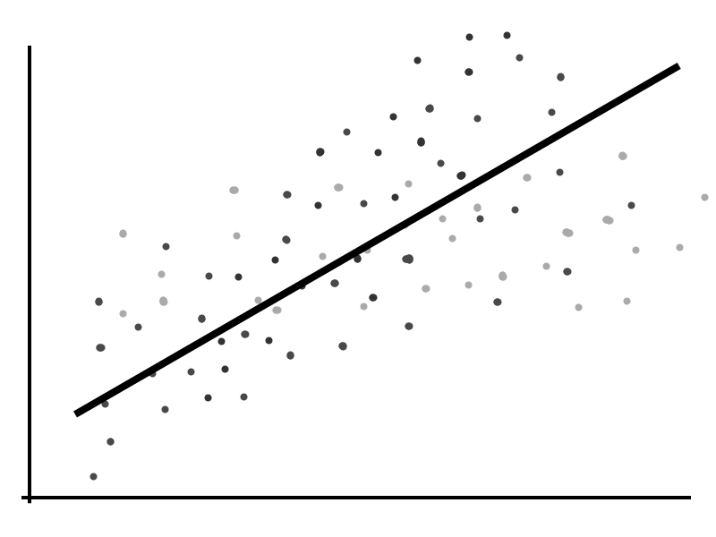
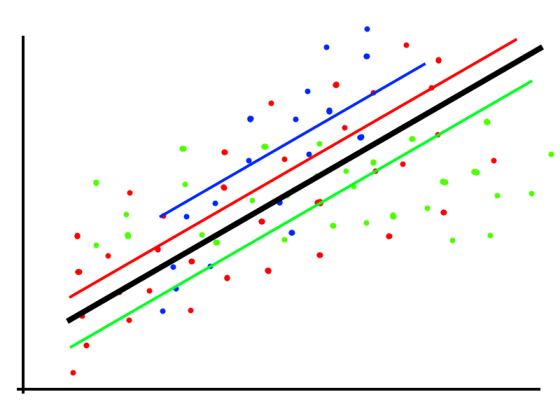
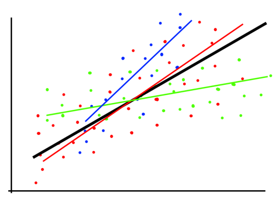

```{r setup, include=FALSE}
knitr::opts_chunk$set(echo = FALSE, fig.align = "center")
```


TODO: include outline of present. 

# Theoretical Part

## Introduction

### Summary

- Educational Expansion and Its Heterogeneous Returns for Wage Workers
- by Michael Gebel and Friedhelm Pfeiffer, published on Schmollers Jahrbuch in
2010
- basic idea: examine evolution of returns to education in West German labour
market. Focus on change in returns to education over time covering education
expansion in Germany.
- methodology:
  - Wooldrigdge's (2004) **conditional mean independence**
  - Garen's (1984) **control function** approach, that requires an *exclusion
  restriction*
  - as well as OLS
- data: SOEP 1984 2006

### Data and Variables  

- Log of hourly wage
- Years of education (constructed from categorical variable)
- Age and age squared
- Gender 
- Father's education
- Mother's ecucation 
- Father's occupation 
- Rural or urban household
- Number of Siblings

TODO: more detailed table?


### Background Information

- **increase in educational attainment** in the 1960s. From 1984 to 2006, avg
years of schooling:
  - woman: 11.3 -> 12.8
  - men: 11.9 -> 12.9
    (but with a shrinking gap over time.)
- unobserved characteristics leading to **selection bias**:
  - higher ability and motivation to stay longer in education
  - select jobs with expected higher returns. 

### A few a priori hypotheses 


| Factors affecting RtE                   | $\Uparrow$ RTE | $\Downarrow$ RTE |
| --------------------------------------- | :------------: | :--------------: |
| Increase in female labour participation |                |   $\checkmark$   |
| Birth cohort sizes (Baby boom)          |                |   $\checkmark$   |
| Wage determination processes (entrants) |                |   $\checkmark$   |
| Skill-biased technological change       | $\checkmark$   |                  |


## Econometric Approach

### Empirical Framework (Derivation) {.allowframebreaks}

The study is based on the **correlated random coefficient model** (Blundell /
Dearden / Sianesi, 2005; Heckman / Vytlacil, 1998; Wooldridge, 2004).
$$\ln Y_i = a_i + b_i S_i$$
with $a_i = a'X_i + \varepsilon_{ai}$, and $b_i = b'X_i + \varepsilon_{bi}$

where $\ln Y_i$ : log of wages and $S_i$ years of schooling of individual $i$

- The model has, therefore, an **individual-specific intercept** $a_i$ and
**slope** $b_i$ dependent on **observables** $X_i$ and **unobservables**
$\varepsilon_{ai}$ and $\varepsilon_{bi}$.

- Do not assume $b_i$ and $S_i$ are independent --> Individuals with higher
expected benefits from education are more likely to remain longer in education
--> $b_i$ may be correlated with $S_i$ meaning positive self-selection.

- focus: estimate average partial effect (APE), which is the return per
aditional year of education for a randomly chosen individual (or averaged across
the population)
$$E(\partial \ln Y / \partial S) = E(b_i) = \beta$$
Would one assume homogenous returns to education: 
$$\ln Y_i = a'X_i + \bar b S_i + \varepsilon_{ai}$$
- Unobserved heterogeneity may only affect the **intercept** of the wage
equation.

- still potential Endogeneity if $\varepsilon_{ai}$ correlates with $S_i$

### Empirical Framework (Intuition) I

{width="300px"}

- Simple OLS

### Empirical Framework (Intuition) II

{width="300px"}

- Multiple OLS with homogenous return to Educ 

### Empirical Framework (Intuition) III


{width="300px"}

- Correlated Random Coefficient Model

### Distinction to conventional methods

- OLS
  - ability and "background" bias
- IV Methods
  - if education correlates with **unobserved individual heterogeneity**, IV methods 
  may fail to identiy APE. 
    - alternative: **L**ocal **A**verage **T**reatment **E**ffect.

### Conditional Mean Independence 

According to Wooldridge (2004, pg. 7), **APE** is identified by: 
$$E \ln Y_i \mid a_i, b_i, S_i, X_i,) = E \ln Y_i \mid a_i, b_i, S_i) = a_i+b_i S_i \qquad (A.1)$$
$$E(S_i \mid a_i, b_i, X_i) = E(S_i \mid X_i) ~~\text{and}~~ \mathrm{Var}(S_i \mid 
a_i, b_i, X_i) = \mathrm{Var} (S_i \mid X_i) \qquad (A.2)$$

TODO: add interpretation of assumptions

### Estimator for $\beta$ and GLM 

$$
\hat \beta = \frac{1}{N} \sum_{i=1}^N \left( \left( S_i - \hat E (S_i \mid X_i) \ln Y_i \right) \middle/
\hat{Var}(S_i \mid X_i)\right)
$$

$$E(S_i \mid X_i ) = e^{\gamma X_i}  ~~~\text{and}~~~ Var(S_i \mid ) = \sigma^2e^{\gamma X_i}
$$
Where $\sigma^2$ can be consistently estimated by the mean of squared Pearson
residuals and standard errors are bootstrapped.

### Control Function Approach {.allowframebreaks}

- Based on proposition by Garen (1984). 
- Similar to Heckman two-step estimator.
- CF approach can identify APE in heterogeneus returns while standard IV
approach may not.


$$S_i = c'X_i + dZ_i + v_i ~~\text{with}~~ E(v_i \mid Z_i, X_i) = 0$$
where:

- $X_i$ and $Z_i$ influence the educational decision.

- $v_i$: Error term incorporating unobserved determinants of education choice.

- $Z_i$: Exclusion restriction.

- $V_i$, $\varepsilon_{ai}$ and $\varepsilon_{bi}$ are normally distributed
  with zero means and positive variances. 

- possible correlation between error terms
  

Augmented Wage equation:
$$\ln Y_i = a_i + \beta S_i + \gamma_1 v_i + \gamma_2 V_iS_i + w_i
$$
where: 

- $\gamma_1 v_i$ and $\gamma_2$ are the **control functions**
  
  - $\gamma_1 = cov(\varepsilon_{ai}, v_i) /var(v_i)$
  
  - $\gamma_2 = cov(\varepsilon_{bi}, v_i) /var(v_i)$

- $E(w_i \mid X_i, S_i, v_i) = 0$ (as shown in Heckman / Robb, 1985)

TODO: intuition for CF approach 


# Replication results

## 

### ...

...
