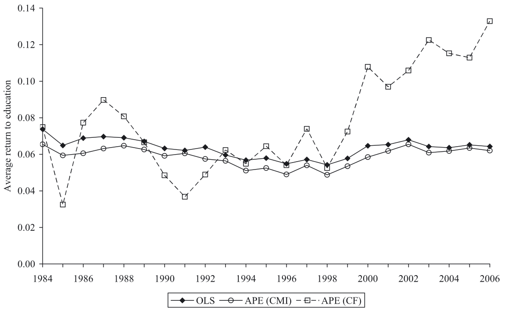
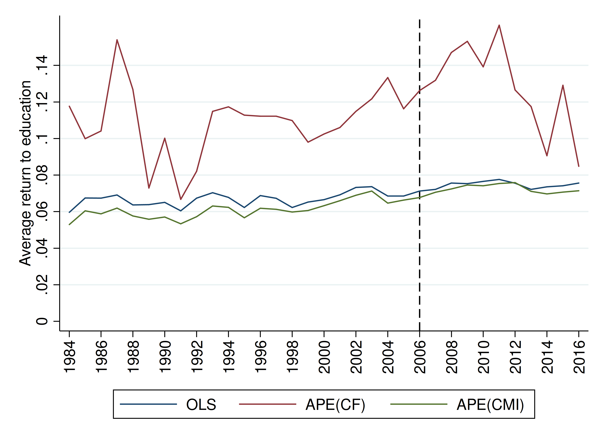

```{r setup, include=FALSE}
knitr::opts_chunk$set(echo = FALSE, fig.align = "center")
library(knitr)
library(kableExtra)
```

# Theoretical Part

### Summary of Gebel & Pfeiffer (2010)

- basic idea: examine evolution of returns to education in West German labour
market. 
- Focus on change in returns to education over time as a consequence to education
expansion in Germany.
- methodology:
  - Wooldrigdge's (2004) **conditional mean independence**
  - Garen's (1984) **control function** approach, that requires an *exclusion
  restriction*
  - as well as OLS
- data: SOEP 1984-2006

### Data and Variables  

- Log of hourly wage
- Years of education (constructed from categorical variable)
- Age and age squared
- Gender 
- Father's education
- Mother's education 
- Father's occupation 
- Rural or urban household
- Number of Siblings (as instrument)

TODO: more detailed table? 
(Comment) not necessary
(Comment) Leave data intro when talking about the model later on?

### Background Information

- **increase in educational attainment** in the 1960s. From 1984 to 2006, average
years of schooling increased:
  - woman: 11.3 -> 12.8
  - men: 11.9 -> 12.9
  
- **How can educational expansion affect the returns to education?**

  -	Standard theory: an increase of labor supply of high-skilled workers should
  decrease the returns to education
  -	High-educated workers with higher unobserved motivation / ability which
  positively affects wages
  -	More “less talented” accepted to higher education & thereby decreasing the
  average productivity levels of higher educated workers --> overall effect not
  clear

- unobserved characteristics leading to **selection bias**:
  - higher ability and motivation to stay longer in education
  - select jobs with expected higher returns. 


## Econometric Approach

### Empirical Framework (Derivation) {.allowframebreaks}

The study is based on the **correlated random coefficient model** (Wooldridge,
2004) specified as:
$$\ln Y_i = a_i + b_i S_i$$
with $a_i = a'X_i + \varepsilon_{ai}$, and $b_i = b'X_i + \varepsilon_{bi}$

where $\ln Y_i$ : log of wages and $S_i$ years of schooling of individual $i$

- The model has, therefore, an **individual-specific intercept** $a_i$ and
**slope** $b_i$ dependent on **observables** $X_i$ and **unobservables**
$\varepsilon_{ai}$ and $\varepsilon_{bi}$.

- Do not assume that $b_i$ and $S_i$ are independent 
--> Individuals with higher expected benefits from education are more likely to
remain longer in education
--> $b_i$ may be correlated with $S_i$ indicating positive self-selection.

- focus: estimate average partial effect (APE), which is the return per
additional year of education for a randomly chosen individual (or averaged across
the population)
$$E(\partial \ln Y / \partial S) = E(b_i) = \beta$$

In case of homogeneous returns to education the wage equation reduces to: 
$$\ln Y_i = a'X_i + \bar b S_i + \varepsilon_{ai}$$
- Unobserved heterogeneity may only affect the **intercept** of the wage
equation.

- still potential endogeneity if $\varepsilon_{ai}$ correlates with $S_i$

### Empirical Framework (Intuition) I

{width="300px"}

- Simple OLS

### Empirical Framework (Intuition) II

{width="300px"}

- Multiple OLS with homogeneous return to Educ 

### Empirical Framework (Intuition) III

{width="300px"}

- Correlated Random Coefficient Model

### Distinction to conventional methods

- OLS
  - ability and "background" bias
- IV Methods
  - if education is correlated with **unobserved individual heterogeneity**, IV
  methods may fail to identity APE.
    - alternative: **L**ocal **A**verage **T**reatment **E**ffect.

### Conditional Mean Independence 

According to Wooldridge (2004, pg. 7), **APE** is identified by: 
$$E (\ln Y_i \mid a_i, b_i, S_i, X_i,) = E (\ln Y_i \mid a_i, b_i, S_i) = a_i+b_i S_i \qquad (A.1)$$
$$E(S_i \mid a_i, b_i, X_i) = E(S_i \mid X_i) ~~\text{and}~~ \mathrm{Var}(S_i \mid 
a_i, b_i, X_i) = \mathrm{Var} (S_i \mid X_i) \qquad (A.2)$$

TODO: add interpretation of assumptions

- basically:

  - $X_i$ should be good predictors of treatment $S_i$ (Wooldridge 2004, pg 7).
  - (A.1): Redundancy of $X_i$ given $a_i$ and $b_i$. 
  - (A.2): In the first two conditional moments of $S_i$, $a_i$ and $b_i$ are
  redundant. "Staying longer in Education is determined by $X$ covariates"

### Estimator for $\beta$ and GLM 

$$\hat \beta = \frac{1}{N} \sum_{i=1}^N \left( \left( S_i - \hat E (S_i \mid X_i) \ln Y_i \right) \middle/
\hat{Var}(S_i \mid X_i)\right)$$

$$E(S_i \mid X_i ) = e^{\gamma X_i}  ~~~\text{and}~~~ Var(S_i \mid ) = \sigma^2e^{\gamma X_i}$$
Where $\sigma^2$ can be consistently estimated by the mean of squared Pearson
residuals and standard errors are bootstrapped.

### Control Function Approach {.allowframebreaks}

- Based on proposition by Garen (1984). 
- Similar to Heckman two-step estimator.
- Models schooling choice explicitly in first step
- CF approach can identify APE in heterogeneous returns while standard IV
approach may not.

First stage: modelling schooling choice

$$S_i = c'X_i + dZ_i + v_i ~~\text{with}~~ E(v_i \mid Z_i, X_i) = 0$$
where:

- $X_i$ and $Z_i$ influence the educational decision.

- $v_i$: Error term incorporating unobserved determinants of education choice.

- $Z_i$: Exclusion restriction (instrument).

- $V_i$, $\varepsilon_{ai}$ and $\varepsilon_{bi}$ are normally distributed
  with zero means and positive variances. 
  
- possible correlation between error terms
 
 - $v_i$ is positive if an individual acquires higher education than expected conditional on observed characteristics

Second step: augmented wage equation
$$\ln Y_i = a_i + \beta S_i + \gamma_1 v_i + \gamma_2 V_iS_i + w_i
$$
where: 

- $\gamma_1 v_i$ and $\gamma_2$ are the **control functions**
  
  - $\gamma_1 = cov(\varepsilon_{ai}, v_i) /var(v_i)$
  
  - $\gamma_2 = cov(\varepsilon_{bi}, v_i) /var(v_i)$

- $E(w_i \mid X_i, S_i, v_i) = 0$ (as shown in Heckman / Robb, 1985)

Interpretation of the coefficients of the control functions
- $\gamma_1$ measures the effect of those unobserved factors that led to over- or under-achievement in education on the wage
    - Thus, if $\gamma_1$ is positive, the unobserved factors affect schooling *and* wages positively
- $\gamma_2$ describes how this effect changes with increasing levels of education
    - Positive coefficient would indicate that those with unexpected educational "over-achievement" tend to earn higher wages

TODO: intuition for CF approach 


# Replication results

##

### Set-up

- We use the same sample: West Germans (not foreign-born or self-employed) between 25 & 60 years who work full-time
- We have less observations than Gebel & Pfeiffer (2010) per survey year after we delete all observations with missing values
- Yet, we extend the observation period until 2016
- Three estimation methods: OLS, CMI & CF
- We are not able to replicate the estimation results of Gebel & Pfeiffer (2010) exactly, yet the trend / shape is similar

### Results

- I'm not so sure how to add images / tables here but in the new do-file link https://1drv.ms/u/s!Ap1Tm8513oIthBjgylALS8Zp3A7G you can just save the graph with all 3 approaches
- & then display on the other side the same graph from GP(2010, p.35)

- also: here is a table with the our & GP estimates for comparisons - your bootstrapped standard errors are already included

https://1drv.ms/x/s!Ap1Tm8513oIthBp5BPId0qO8h3Yj

### Estimated returns on education

- Estimates from OLS & CMI are similar, yet, CMI produces lower estimates which points to a positive self-selection bias
- Generally, CF estimates are much more volatile and less precise

Differences between replicated & original estimations
- Our OLS estimates are on average larger than those of Gebel & Pfeiffer (2010) by 0.004 percentage points
- Our CMI estimates are on average larger than those of Gebel & Pfeiffer (2010) by 0.002 percentage points (first years lower, than larger)
- Our CF estimates are on average significantly larger by 0.032 percentage points, though the divergence gets smaller from 2000 onwards

### Control function estimates {.allowframebreaks}

Instrumental variable in first stage
- *Number of siblings* is significant at the 0.1% level for all years
- As expected, the number of siblings has a negative impact on the years of schooling (the estimates range between -0.13 & -0.23)
- We would assume that the instrument does not directly affect the error term in the wage equation

Coefficients of the control functions
- $\gamma_1$ is negative for majority of years, yet very small and insignificant in all years
    - Gebel & Pfeiffer (2010) estimate a positive coefficient in the 1980s and 1990s - but also insignificant
-  $\gamma_2$ is negative and close to zero for most years
    - Indicates that those with unexpectedly high education have lower returns to education
    - Similarly, they are only slightly significant in the 1980s, and stronger significant in the early 2000s
    - The estimates are very similar to those of Gebel & Pfeiffer (2010)

- that both coefficients are (mostly) negative hints that educational expansion caused more “less able” to achieve higher education

### Explanations for divergences between replication and Gebel & Pfeiffer (2010)

- sample not the same
- ...

### Pro's & Con's of estimation methods

- CMI

- CF
  - requires further distributional assumptions on error terms

### Results and Comparison I

{height="250px"}

### Results and Comparison II

{height="250px"}


```{r include=FALSE}
dfCF <- read.csv("./tables/comparisonsCF.csv", dec=",")
dfGP <- read.csv("./tables/comparisonsGP2010.csv", dec=",")
dfRp <- read.csv("./tables/comparisonsRep.csv", dec=",")
fontSize = 7
```

```{r}
kable(x = dfCF,
      format = "latex",
      longtable = TRUE,
      booktabs = TRUE) %>% 
  add_header_above(c(" ", "IV: Nr. of Siblings"=2,"$v_i$"=3, "$v_i S_i$"=3 ),
                   escape = FALSE) %>% 
  add_header_above(c(" ", "First Stage" = 2, "Second Stage" = 6)) %>% 
  kable_styling(latex_options = c("repeat_header"),
                font_size = fontSize)
```

```{r}
kable(x = dfGP,
      format = "latex",
      longtable = TRUE,
      booktabs = TRUE) %>% 
  kable_styling(latex_options = c("repeat_header"),
                font_size = fontSize)
```

```{r}
kable(x = dfRp,
      format = "latex",
      longtable = TRUE,
      booktabs = TRUE) %>% 
  kable_styling(latex_options = c("repeat_header"),
                font_size = fontSize)

```


### The end {.allowframebreaks}
