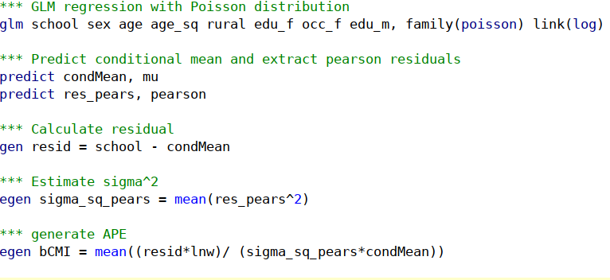
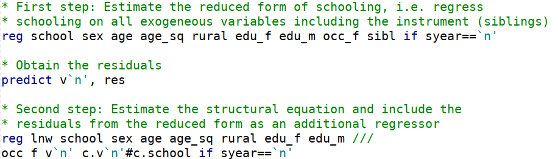

```{r setup, include=FALSE}
knitr::opts_chunk$set(echo = FALSE, fig.align = "center")
def.chunk.hook  <- knitr::knit_hooks$get("chunk")
knitr::knit_hooks$set(chunk = function(x, options) {
  x <- def.chunk.hook(x, options)
  ifelse(options$size != "normalsize", paste0("\\", options$size,"\n\n", x, "\n\n \\normalsize"), x)
})
```

```{r library, include=FALSE}
library(knitr)
library(kableExtra)
```

# Introduction {.L}

### Outline {.L}

- Theoretical Framework

    - Gebel & Pfeiffer (2010)
    - Returns to education
- Empirical framework

    - Correlated random coefficients model
    - Conditional Mean approach
    - Control funtion approach
- Replication
    - Set-up 
    - Code
    - Comparison of results

## Theoretical Framework

### Summary of Gebel and Pfeiffer (2010) {.M}

- Basic idea: examine evolution of returns to education in West German labour
market. 
- Focus on change in returns to education over time as a consequence to education
expansion in Germany.
- methodology:

    - Wooldrigdge's (2004) **conditional mean independence**
    - Garen's (1984) **control function** approach, that requires an 
    *exclusion restriction*
    - as well as OLS regression
- data: SOEP 1984-2006


### Background Information {.allowframebreaks .L}

**Increase in educational attainment** 

{height="200px"}

  
**How can educational expansion affect the returns to education?**

  -	Standard theory: an increase of labor supply of high-skilled workers should
  decrease the returns to education
  -	High-educated workers with higher unobserved motivation / ability which
  positively affects wages
  -	If more less talented are accepted to higher education, this should decrease the
  average productivity levels of higher educated workers --> overall effect not
  clear

**Problems in the estimation of returns to education**

- unobserved characteristics leading to **selection bias**:
  - higher ability and motivation to stay longer in education.
  - select jobs with higher expected returns. 


## Econometric Approach 

### Empirical Framework (Derivation) {.allowframebreaks .M}

The study is based on the **correlated random coefficient model** (Wooldridge,
2004) specified as:
$$\ln Y_i = a_i + b_i S_i$$
with $a_i = a'X_i + \varepsilon_{ai}$, and $b_i = b'X_i + \varepsilon_{bi}$

where $\ln Y_i$ : log of wages and $S_i$ years of schooling of individual $i$

- The model has, therefore, an **individual-specific intercept** $a_i$ and
**slope** $b_i$ dependent on **observables** $X_i$ and **unobservables**
$\varepsilon_{ai}$ and $\varepsilon_{bi}$.

- Do not assume that $b_i$ and $S_i$ are independent 
--> Individuals with higher expected benefits from education are more likely to
remain longer in education
--> $b_i$ may be correlated with $S_i$ indicating positive self-selection.

- focus: estimate average partial effect (APE), which is the return per
additional year of education for a randomly chosen individual (or averaged across
the population)
$$E(\partial \ln Y / \partial S) = E(b_i) = \beta$$

In case of homogeneous returns to education the wage equation reduces to: 
$$\ln Y_i = a'X_i + \bar b S_i + \varepsilon_{ai}$$

- Unobserved heterogeneity may only affect the **intercept** of the wage
equation.

- still potential endogeneity if $\varepsilon_{ai}$ correlates with $S_i$

### Empirical Framework (Intuition) I {.M}

{width="300px"}


### Empirical Framework (Intuition) II {.M}

{width="300px"}


### Empirical Framework (Intuition) III {.M}

{width="300px"}


### Distinction to conventional methods {.M}

- OLS

    - ability and "background" bias
- IV Methods:

    - suitable if assume homogeneous returns to education.
   - if education is correlated with **unobserved individual heterogeneity**, IV
  methods may fail to identity APE.
    - alternative: **L**ocal **A**verage **T**reatment **E**ffect if interested 
    in effect of educational policy reforms.


### Conditional Mean Independence {.M}

According to Wooldridge (2004, pg.7), **APE** is identified by: 
$$E (\ln Y_i \mid a_i, b_i, S_i, X_i,) = E (\ln Y_i \mid a_i, b_i, S_i) = a_i+b_i S_i \qquad (A.1)$$
$$E(S_i \mid a_i, b_i, X_i) = E(S_i \mid X_i) ~~\text{and}~~ \mathrm{Var}(S_i \mid 
a_i, b_i, X_i) = \mathrm{Var} (S_i \mid X_i) \qquad (A.2)$$


- $X_i$ should be "good predictors"" of treatment $S_i$ (Wooldridge 2004, pg.7).
- (A.1): Redundancy of $X_i$ given $a_i$ and $b_i$ and $S_i$. 
- (A.2): In the first two conditional moments of $S_i$, $a_i$ and $b_i$ are
  redundant --> "Staying longer in Education is determined by $X$ covariates".

### Estimator for $\beta$ and GLM {.M}

The **APE** can be estimated by:

$$\hat \beta = \frac{1}{N} \sum_{i=1}^N \left( \left( S_i - \hat E (S_i \mid X_i) \ln Y_i \right) \middle/
\hat{Var}(S_i \mid X_i)\right)$$

$$E(S_i \mid X_i ) = e^{\gamma X_i}  ~~~\text{and}~~~ Var(S_i \mid X_i ) = \sigma^2e^{\gamma X_i}$$
Where $\sigma^2$ can be consistently estimated by the mean of squared Pearson
residuals and standard errors are bootstrapped.

### Control Function Approach {.allowframebreaks .L}

- Based on proposition by Garen (1984). 
- CF approach can identify APE in heterogeneous returns while standard IV
approach may not.
- Similar to Heckman two-step estimator.
- Models schooling choice explicitly in first step

**First step**: modelling schooling choice

$$S_i = c'X_i + dZ_i + v_i ~~\text{with}~~ E(v_i \mid Z_i, X_i) = 0$$
where:

- $X_i$ and $Z_i$ influence the educational decision.

- $v_i$: Error term incorporating unobserved determinants of education choice.

- $Z_i$: Exclusion restriction (instrument).

- $v_i$, $\varepsilon_{ai}$ and $\varepsilon_{bi}$ are normally distributed
  with zero means and positive variances, that are possibly correlated
 
 - $v_i$ is positive if an individual acquires higher education than expected conditional on observed characteristics

**Second step**: augmented wage equation
$$\ln Y_i = a_i + \beta S_i + \gamma_1 v_i + \gamma_2 V_iS_i + w_i
$$
where: 

- $\gamma_1$ and $\gamma_2$ are the **control functions**
  
  - $\gamma_1 = cov(\varepsilon_{ai}, v_i) /var(v_i)$
  
  - $\gamma_2 = cov(\varepsilon_{bi}, v_i) /var(v_i)$

- $E(w_i \mid X_i, S_i, v_i) = 0$ (as shown in Heckman / Robb, 1985)


### Control Function Approach III {.L}

Interpretation of the coefficients of the control functions

- $\gamma_1$ measures the effect of those unobserved factors that led to over- or under-achievement in education on the wage
    - Thus, if $\gamma_1$ is positive, the unobserved factors affect schooling *and* wages positively
- $\gamma_2$ describes how this effect changes with increasing levels of education
    - Positive coefficient would indicate that those with unexpected educational "over-achievement" tend to earn higher wages


# Replication and Comparison

## Replication and Comparison

### Set-up {.L}

- We use the same sample: West Germans (not foreign-born or self-employed) between 25 and 60 years who work full-time
- We have less observations than Gebel and Pfeiffer (2010) per survey year after we delete all observations with missing values
- Yet, we extend the observation period until 2016
- Three estimation methods: OLS, CMI  CF
- control variables: age and age squared, gender, father's education, mother's education, father's occupation, rural or urban household, number of siblings (as instrument)

### Stata Implementation (CMI) {.CMI}



### Stata Implementation (Bootstrapping) {.bootstrappp}


### Stata Implementation (CF) {.CF}



## Results

### Results Comparison I {.M}

{height="250px"}

### Results Comparison II {.M}

{height="250px"}


### Estimated returns on education {.M}

- Estimates from OLS and CMI are similar, yet, CMI produces lower estimates which points to a positive self-selection bias
- Generally, CF estimates are much more volatile and less precise

Differences between replicated and original estimations
- Our OLS estimates are on average larger than those of Gebel and Pfeiffer (2010) by 0.004 percentage points
- Our CMI estimates are on average larger than those of Gebel and Pfeiffer (2010) by 0.002 percentage points (first years lower, than larger)
- Our CF estimates are on average significantly larger by 0.032 percentage points, though the divergence gets smaller from 2000 onwards

### Control function estimates {.allowframebreaks .L}

Instrumental variable in first step

- *Number of siblings* is significant at the 0.1% level for all years
- As expected, the number of siblings has a negative impact on the years of schooling (the estimates range between -0.13 and -0.23)
- We would assume that the instrument does not directly affect the error term in the wage equation

Coefficients of the control functions

- $\gamma_1$ is negative for majority of years, yet very small and insignificant in all years
    - Gebel and Pfeiffer (2010) estimate a positive coefficient in the 1980s and 1990s - but also insignificant
-  $\gamma_2$ is negative and close to zero for most years
    - Indicates that those with unexpectedly high education have lower returns to education
    - Similarly, they are only slightly significant in the 1980s, and stronger significant in the early 2000s
    - The estimates are very similar to those of Gebel and Pfeiffer (2010)

- that both coefficients are (mostly) negative hints that educational expansion caused more "less abled" to achieve higher education


### Heterogenous returns to education {.forfun}

{height="250px"}

### Heterogenous returns to education {.forfun}

{height="250px"}


### Results: Control Function (replication)


```{r include=FALSE}
dfCF <- read.csv("./tables/comparisonsCF.csv", dec=",")
dfGP <- read.csv("./tables/comparisonsGP2010.csv", dec=",")
dfRp <- read.csv("./tables/comparisonsRep.csv", dec=",")
fontSize = 7
names(dfCF) <- c("year", "coef.", "s.e.",
                 "coef.", "s.e.", "p", 
                 "coef.", "s.e.", "p")

```

```{r}
kable(x = head(dfCF, 14),
      caption = "Summary of Control Function estimates (replication)",
      format = "latex",
      longtable = TRUE,
      booktabs = TRUE,
      escape = F) %>% 
  add_header_above(c(" ", "IV: Nr. of Siblings"=2,"$v_i$"=3, "$v_i S_i$"=3 ),
                   escape = FALSE) %>% 
  add_header_above(c(" ", "First Stage" = 2, "Second Stage" = 6)) %>% 
  kable_styling(latex_options = c("repeat_header"),
                font_size = fontSize)
```


### Heterogenous returns to education by gender I {.forfun}

{height="250px"}

### Heterogenous returns to education by gender II {.forfun}

{height="250px"}


## Conclusion

### Conclusion

- CMI
  - no analytical standard errors

- CF
  - requires further distributional assumptions on error terms
  - valid and relevant "instrument"

## The end

### Appendix {.allowframebreaks}

```{r}
names(dfGP) <- c("year",
                 "OLS", "s.e. (OLS)",
                 "CMI", "s.e. (CMI)",
                 "CF", "s.e. (CF)",
                 "obs")

kable(x = dfGP,
      caption = "Summary original results GB(2010).",
      format = "latex",
      longtable = TRUE,
      booktabs = TRUE) %>% 
  kable_styling(latex_options = c("repeat_header"),
                font_size = fontSize)
```

```{r}
names(dfRp) <- c("year",
                 "OLS", "s.e. (OLS)",
                 "CMI", "s.e. (CMI)",
                 "CF", "s.e. (CF)",
                 "obs")

kable(x = dfRp,
      caption = "Summary replication results.",
      format = "latex",
      longtable = TRUE,
      booktabs = TRUE) %>% 
  kable_styling(latex_options = c("repeat_header"),
                font_size = fontSize)
```
